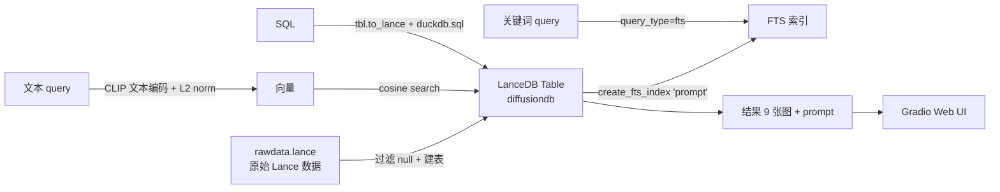

# Skill: Multimodal CLIP × DiffusionDB 图像检索

> 路径：[`examples/multimodal_clip_diffusiondb`](/data/workspace/vectordb-recipes/examples/multimodal_clip_diffusiondb)
> 演示用 **OpenAI CLIP** 在 **DiffusionDB**（AI 生成图集）上做向量检索 / 全文检索 / SQL 过滤，并通过 Gradio 暴露 Web UI。

---

## 1. Demo 简介

- **数据集**：[DiffusionDB](https://huggingface.co/datasets/poloclub/diffusiondb) — 大规模 Stable Diffusion 生成图 + Prompt 数据集，每张图自带 `prompt`、`cfg`、`seed`、`step`、`sampler`、`image_nsfw`、`prompt_nsfw` 等 metadata。
- **模型**：`openai/clip-vit-base-patch32`（HuggingFace transformers 加载）
- **能力**：
  - 🧠 **Embedding 检索**：自然语言 → 图（语义相似）
  - 🔎 **Keyword 检索**：基于 `prompt` 的 BM25 全文检索
  - 🗄 **SQL 检索**：用 DuckDB 直接查 lance 文件做 metadata 过滤

预置数据下载：

```bash
wget https://eto-public.s3.us-west-2.amazonaws.com/datasets/diffusiondb_lance.tar.gz
tar -xvf diffusiondb_lance.tar.gz
mv diffusiondb_test rawdata.lance
```

---

## 2. 目录结构

```
multimodal_clip_diffusiondb/
├── README.md          # 官方简介 + 数据下载方法
├── main.py            # ⭐ 核心脚本，启动 Gradio
├── main.ipynb         # Notebook 版（教程逻辑相同）
├── requirements.txt   # 依赖
├── test.py            # 简单测试脚本
└── rawdata.lance/     # 解压得到的 lance 数据集（约 5.7 GB）
    ├── _latest.manifest
    ├── _versions/
    └── data/*.lance
```

---

## 3. 核心流程



### 3 种检索路径对应的入口函数

| 入口 | 实现函数 | 后端 |
| --- | --- | --- |
| Embeddings Tab | `find_image_vectors` | `tbl.search(emb).metric("cosine").limit(9)` |
| Keywords Tab | `find_image_keywords` | `tbl.search(query, query_type="fts").limit(9)` |
| SQL Tab | `find_image_sql` | `duckdb.sql(query)` 直接查 `tbl.to_lance()` |

---

## 4. 关键代码片段（沉淀自实际调试）

### 4.1 建表 + FTS 索引

```python
def create_table(dataset):
    db = lancedb.connect("~/datasets/demo")
    if "diffusiondb" in db.table_names():
        return db.open_table("diffusiondb")

    data = lance.dataset(dataset).to_table()
    tbl = db.create_table(
        "diffusiondb", data.filter(~pc.field("prompt").is_null()), mode="overwrite"
    )
    # ⚠ 新版 lancedb (>=0.10) 的 native FTS 一次只能为一个字段建索引
    tbl.create_fts_index("prompt")
    return tbl
```

**踩坑点**：
- 老教程里写的是 `create_fts_index(["prompt"])` 同时给多个字段建索引，新版会报错，必须**单字段单次调用**。
- 没建 FTS 索引时，`tbl.search("ninja turtle").limit(9)` 会**默认走向量检索路径**而非全文，相关性极差。

### 4.2 CLIP 文本编码 + L2 归一化

```python
def embed_func(query):
    inputs = TOKENIZER([query], padding=True, return_tensors="pt")
    text_features = MODEL.get_text_features(**inputs)
    emb = text_features.detach().numpy()[0]
    # ⚠ CLIP 输出未归一化，必须先 L2 normalize 再做 cosine 检索
    emb = emb / np.linalg.norm(emb)
    return emb.astype("float32")
```

**踩坑点**：
- DiffusionDB 自带的图像 embedding 是**已归一化**的（CLIP 标准做法）。
- 如果文本端不归一化，cosine 距离就会被向量长度污染，召回明显变差（这是 "cat 检索图片相关性差" 的关键原因之一）。
- 必须显式调用 `.metric("cosine")`，否则默认 L2，与训练阶段不一致。

### 4.3 关键词检索必须显式声明 `query_type="fts"`

```python
def find_image_keywords(query):
    return _extract(
        tbl.search(query, query_type="fts").limit(9).to_pandas()
    )
```

**踩坑点**：
- 不传 `query_type="fts"`，lancedb 会按字符串走向量分支（用 embedding 函数），**导致全文检索无效**。

### 4.4 SQL 检索通过 DuckDB 直读 Lance

```python
def find_image_sql(query):
    diffusiondb = tbl.to_lance()       # 把 lancedb table 转成 lance dataset
    return duckdb.sql(query).to_df()   # DuckDB 自动识别 Python 作用域内的 dataset 变量
```

**踩坑点**：
- 变量名必须叫 `diffusiondb`（与 SQL 里的表名一致），DuckDB 通过这个名字反查 Python 局部变量。
- DiffusionDB 自带的 `image_nsfw` 列是 NSFW 评分（越低越正常），默认示例 `WHERE image_nsfw >= 2` 反而会过滤出**模糊/异常图**，体验差。
- 推荐改用 **`cfg = 12`** 这种业务字段过滤（CFG = classifier-free guidance scale，AI 绘画里常见参数），兼顾效果与速度。

### 4.5 默认对外暴露的 Gradio 启动参数

```python
def create_gradio_dash(server_name="0.0.0.0", server_port=7860, share=True):
    ...
    demo.launch(server_name=server_name, server_port=server_port, share=share)
```

| 参数 | 默认 | 作用 |
| --- | --- | --- |
| `--host` | `0.0.0.0` | 监听所有网卡，便于局域网/服务器访问 |
| `--port` | `7860` | Gradio 默认端口 |
| `--share` | `True` | 生成 `*.gradio.live` 临时公网链接（72h） |
| `--no-share` | — | 关闭公网链接 |

---

## 5. 常见踩坑速查表

| 现象 | 根因 | 解决 |
| --- | --- | --- |
| `tbl.search('ninja turtle')` 返回不相关结果 | 没建 FTS 索引 / 没传 `query_type="fts"` | `create_fts_index("prompt")` + 显式参数 |
| 文本检索 "cat" 相关性强，但向量检索 "cat" 几乎全错 | 文本 embedding 未归一化 | 加 `emb / np.linalg.norm(emb)` |
| `create_fts_index(["a","b"])` 报错 | 新版 lancedb 不支持多字段一次建索引 | 拆成多次单字段调用 |
| 默认 SQL 过滤出来的图都很糊 | `image_nsfw >= 2` 过滤的是异常图 | 改用 `cfg = 12` 或 `step >= 50` |
| `WHERE prompt LIKE '%xxx%'` 慢到无法接受 | 全表正则扫描 5GB 数据 | 改用结构化字段（cfg/sampler/step） |
| Gradio 仅 127.0.0.1 可访问 | 默认绑定 localhost | `server_name="0.0.0.0"` 或 `--share` |
| HuggingFace 模型下载慢 | 国内网络 | 设 `HF_ENDPOINT=https://hf-mirror.com` |

---

## 6. 运行指南

### 6.1 安装依赖

```bash
cd examples/multimodal_clip_diffusiondb
pip install -r requirements.txt
# 通常还需：
pip install gradio==3.50 transformers torch lancedb pylance duckdb pyarrow pillow
```

### 6.2 准备数据

```bash
wget https://eto-public.s3.us-west-2.amazonaws.com/datasets/diffusiondb_lance.tar.gz
tar -xvf diffusiondb_lance.tar.gz
mv diffusiondb_test rawdata.lance
```

### 6.3 启动

```bash
# 本地 + 公网临时分享链接
python main.py

# 仅局域网，不生成公网链接
python main.py --no-share

# 自定义端口
python main.py --port 8080
```

启动后访问：
- 本机：`http://127.0.0.1:7860`
- 局域网：`http://<服务器IP>:7860`
- 公网（如启用 share）：终端打印的 `https://xxxxx.gradio.live`

---

## 7. 可优化方向

1. **模型升级**：当前 OpenAI CLIP ViT-B/32 是 2021 年模型，在中文/细粒度类目上召回差。
   - 升级到 `openai/clip-vit-large-patch14`（精度↑，速度↓）
   - 或换 [Jina-CLIP v2](../) — 多语言 + Matryoshka，对应 `multimodal_jina_clipv2` demo
   - 或商业版 Voyage `voyage-multimodal-3`，对应 `voyagexlancedb` demo
2. **创建向量索引**：当前未对 vector 列建 IVF_PQ 索引，大数据量下检索慢；
   `tbl.create_index(num_partitions=256, num_sub_vectors=96)` 可显著提速。
3. **混合检索**：把 vector + FTS 用 `query_type="hybrid"` + reranker 组合，召回与精度兼顾。
4. **图像端编码**：当前只用 embedding 文本检索图，但图像 embedding 是数据集自带的；
   想做 image-to-image 时需走 `MODEL.get_image_features` + 同样 L2 归一化。
5. **NSFW 过滤**：可在 SQL Tab 默认值里加 `image_nsfw < 0.5 AND prompt_nsfw < 0.5` 提升观感。

---

## 8. 关联资源

- 官方 README：[`examples/multimodal_clip_diffusiondb/README.md`](/data/workspace/vectordb-recipes/examples/multimodal_clip_diffusiondb/README.md)
- Colab：[main.ipynb on Colab](https://colab.research.google.com/github/lancedb/vectordb-recipes/blob/main/examples/multimodal_clip_diffusiondb/main.ipynb)
- LanceDB 文档：<https://lancedb.github.io/lancedb/>
- DiffusionDB 数据集主页（HuggingFace）：<https://huggingface.co/datasets/poloclub/diffusiondb>
- DiffusionDB 论文：<https://arxiv.org/abs/2210.14896>
